# 一、ffmpeg

## 安装

- 源码下载：`git clone https://git.ffmpeg.org/ffmpeg.git`
- 编译配置：`./configure 参数`
- 编译安装：`make && make install`
- macOS 通过 brew 安装：`brew install ffmpeg`（功能固定，不可定制）
- 源码编译安装（可定制功能）：
  ```
  ./configure --prefix=/usr/local/ffmpeg --enable-debug=3
  make -j 4
  make install
  ```
- macOS 环境变量配置：`vi ~/.bash_profile`

## 处理流程

1. 输入文件
2. 编码数据包（文件分解成数据包）
3. 解码后的数据帧（数据包解码成数据帧，高度还原的原始数据）
4. 编码数据包（数据帧编码成数据包）
5. 输出文件（数据包复用成文件）

## 常用命令分类

- 基础信息查询命令
- 视频录制命令
- 多媒体文件的分解/复用命令（文件格式转换）
- 处理原始数据命令
- 裁剪与合并命令
- 图片/视频互转命令
- 直播相关命令
- 各种滤镜命令

## 推流/拉流命令

- 推流：`ffmpeg -i ~/xxx/xxx.mp4 -f flv rtmp://localhost/live/test`
- 拉流：`ffplay rtmp://localhost/live/test`
- 卡顿问题：音视频不同步，加参数 `-re` 同步播放
- 不清晰问题：加参数 `-c:v copy` 采用原编码避免重编码

## 音视频基础知识

### RGB 与 YUV 色彩空间

- **RGB**（红、绿、蓝）：用于图像采集和显示，BMP 文件格式使用 RGB
  - 图片与 BMP 互转：`ffmpeg -i test.jpg test.bmp` & `ffmpeg -i test.bmp test.jpg`
- **YUV**（Y亮度，U色调，V色饱和度）：用于编码和存储
  - 存储前：RGB → YUV
  - 显示前：YUV → RGB

### 编码压缩

- YUV 数据仍较大，需进一步压缩
- 压缩标准：JPEG、H.262、H.263、H.264、VP9、AVS

### 封装格式（Mux 复用）

- 将多个流数据（音视频等）合并到一个文件中
- 封装格式定义了数据结构，各数据位置固定

## 开发路线

### 基础开发

- C 语言回顾
- 核心概念与常用结构体
- 多媒体文件的分解与复用
- 多媒体格式互转
- 从 MP4 裁剪一段视频

### 音视频编解码实战

- H264 解码/编码
- AAC 解码/编码
- 视频转图片

### 音视频渲染实战

- SDL

### 播放器核心功能

- MP4 文件视频播放/音频播放
- 实现初级播放器
- 音视频同步
- 播放器内核实现

### Android 实战

- ffmpeg 编译
- Java 调用 C 语言

## Linux 开发基础

- 基础命令：`ls`、`cd`、`pwd`、`mkdir`、`cp`、`rm`、`mv`、`sudo`、`pkg-config`
- 安装工具：`apt`、`brew`、`yum`
- vim 操作：`:w`、`:q`、`:wq`、`i`、`esc`、`h/j/k/l`
- 环境变量：`PATH`、`PKG_CONFIG_PATH`
  - 配置文件：`~/.bashrc`、`~/.bash_profile`
  - 生效命令：`source`
  - 查看所有环境变量：`env`
- 查看 ffmpeg 库的头文件和库位置：`pkg-config --libs --cflags libavutil`
  - `PKG_CONFIG_PATH` 需配置 ffmpeg 的 `/usr/local/ffmpeg/lib/pkgconfig` 路径

---

# 二、Hexo 博客搭建

## 什么是 Hexo？

- 一个快速、简洁且高效的博客框架 [[Hexo中文官网]](https://hexo.io/zh-cn/)

## 本地环境

- nodejs
- git

## 本地项目搭建

1. 安装 hexo 客户端：`npm install -g hexo-cli`
2. 新建文件夹：`myblog`
3. 初始化 hexo，在文件夹下执行：`hexo init`
   - 目录结构
     - `node_modules`：依赖包
     - `scaffolds`：生成文章的模板
     - `source`：存放文章
     - `themes`：主题
     - `_config.yml`：博客配置文件
   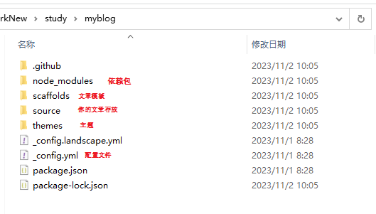
4. 启动运行：`hexo server`
   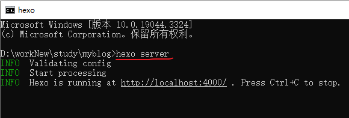
5. 访问 `http://localhost:4000/`
   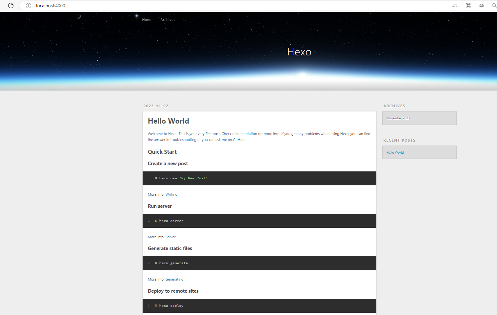

## 新增主题

- 官网选择主题 [[主题选择网址]](https://hexo.io/themes/)
- 示例主题：`snippet`
  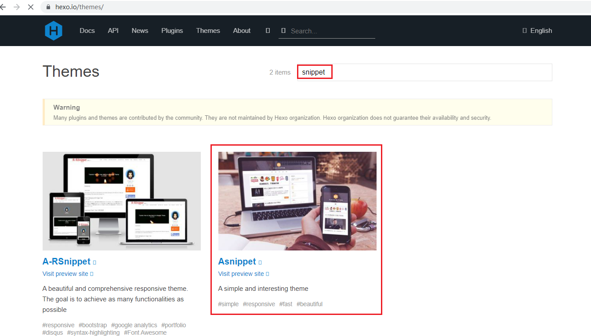
- 进入 `themes` 目录拉取代码：`git clone https://github.com/shenliyang/hexo-theme-snippet.git`
  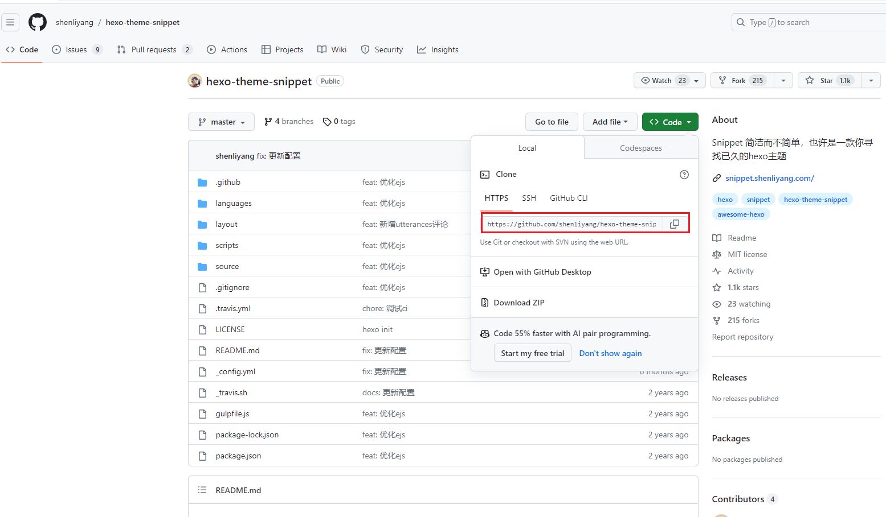
  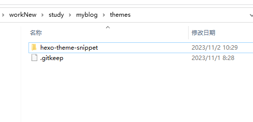
- `_config.yml` 中配置主题：`theme: hexo-theme-snippet`
- 重新启动：`hexo server`
  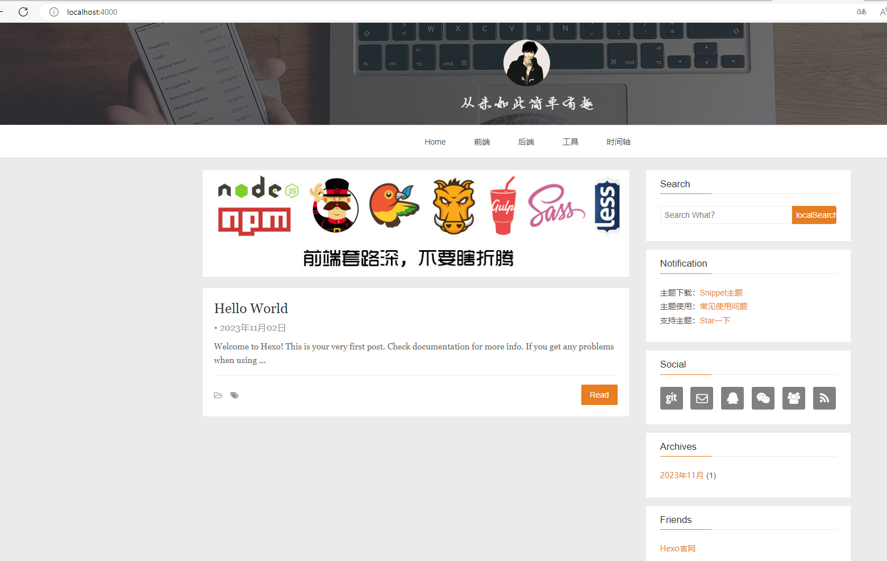
- 各主题配置参见其 md 文档，按需配置
  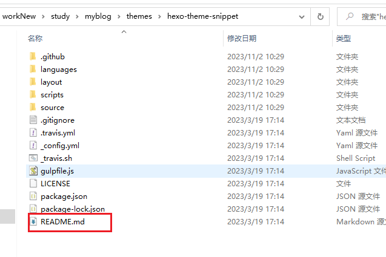

## 写博客

- 新建分类：`hexo new page "categories"`
- 新建标签：`hexo new page "tags"`
- 新建文章：`hexo new 文件名`（在 `_posts` 下生成 md 文件）
  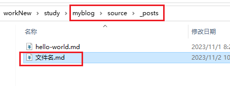
  - 文件内容格式（Front Matter + 正文）：
  ```md
  ---
  title: 文件名
  createTime: 2023/11/02 10:41:01
  tags:
    - xxx
    - hhh
  ---
  # 标题1
  - 哈哈哈
  ```
  
- md 文件中插入图片等资源 [[官网资源配置]](https://hexo.io/zh-cn/docs/asset-folders)
  - 建一个和 md 文件名相同的文件夹，将图片放在下面
  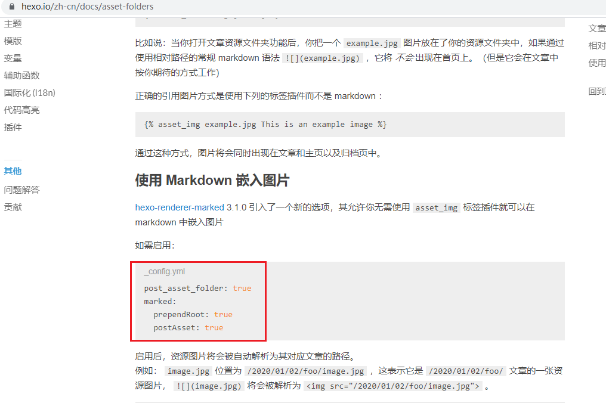

## 部署到 GitHub

- 教程 [[官网教程]](https://hexo.io/zh-cn/docs/github-pages)
1. 新建 GitHub 仓库，仓库名为 `账号名.github.io`，初始化 `main` 分支
2. 新建 `source` 分支并初始化
3. 本地拉取 `source` 分支代码
   - 将本地博客项目文件复制过去（除 `.deploy_git`、`.github`、`.git` 等，themes 下主题中的 `.github` 也删除）
   - 新建 `.gitignore`：
   ```
   .DS_Store
   .idea/
   Thumbs.db
   db.json
   *.log
   node_modules/
   public/
   .deploy*/
   _multiconfig.yml
   package-lock.json
   ```
4. 推送代码到 `source` 分支
5. 配置 Git SSH 公钥
6. 安装部署插件：`npm install hexo-deployer-git --save`
   - `_config.yml` 中配置部署：
   ```yml
   deploy:
     type: git
     repo: git@github.com:AAAJQHAAA/aaajqhaaa.github.io.git
     branch: main
   ```
7. 打包部署（编译后的文件推送到主分支）
   - 清除：`npm run clean`
   - 打包：`npm run build`
   - 部署：`npm run deploy`
8. GitHub 配置访问
   - `settings` → `pages` → `Source` → 选择部署主分支
   - 访问地址：`账号名.github.io`
   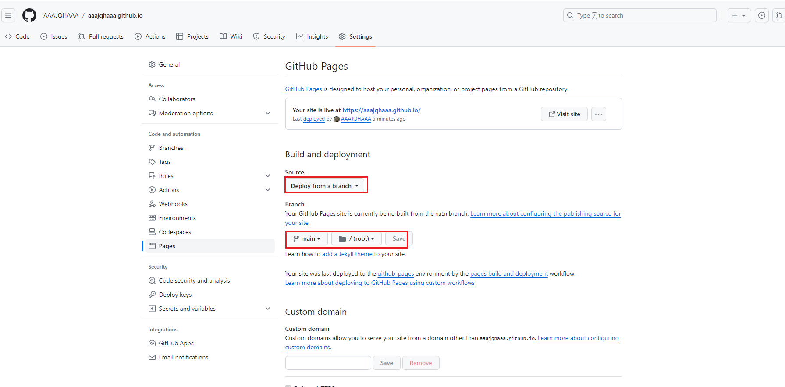

---

# 三、OnlyOffice

## 介绍

- OnlyOffice 是一个多端协同的 Office 办公套件，包含文本文档、电子表格、演示文稿和表单编辑器
- 技术栈：
  - 后端：JavaScript + Node.js
  - 前端：HTML5 Canvas 呈现文档元素
- 核心格式：OOXML（与 DOCX、XLSX、PPTX 完全兼容），其他格式通过内部转换处理
- 协作功能：实时协同编辑、评论、在线聊天、版本历史、跟踪更改、文档比较
- 共享权限：完全访问、仅查看、评论、审阅、填写表单、自定义筛选
- 集成方式：基于 API 通信 或 WOPI 协议
- 部署方式：Windows / Linux 服务器安装、Docker、Pod

## 服务架构

- 客户端：浏览器中运行完整编辑器，大部分负载转移到客户端
- 服务器端：仅处理保存、传输文件更改、拼写检查
- 每个服务可独立托管在集群中，增强容错能力
- 配置参考：32GB RAM + 8 核机器可承载 1000 个同时编辑的文档（每4秒更改一次）
  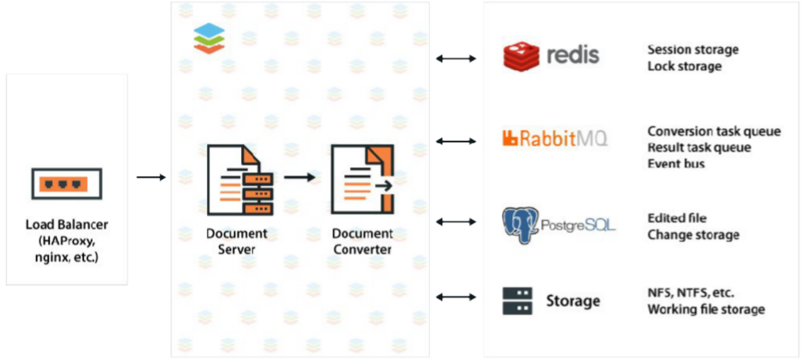

## 编辑功能

### 支持的文件格式

| | 查看 | 编辑 | 下载 |
| :------ | :------ | :------ | :------ |
| 文本文档 | DOC, DOCX, DOTX, FB2, ODT, OTT, RTF, TXT, PDF, PDF/A, HTML, EPUB, XPS, DjVu, XML, DOCXF, OFORM | DOC, DOCX, DOTX, FB2, ODT, OTT, RTF, TXT, HTML, EPUB, XML, DOCXF, OFORM | DOCX, DOTX, FB2, ODT, OTT, RTF, TXT, PDF, PDF/A, HTML, EPUB, DOCXF, OFORM |
| 电子表格 | XLS, XLSX, XLTX, ODS, OTS, CSV | XLS, XLSX, XLTX, ODS, OTS, CSV | XLSX, XLTX, ODS, OTS, CSV, PDF, PDF/A |
| 演示文稿 | PPT, PPTX, POTX, ODP, OTP, PPSX | PPT, PPTX, POTX, ODP, OTP | PPTX, POTX, ODP, OTP, PDF, PDF/A, PNG, JPG |

## 协作功能

- 任意数量用户协同编辑，客户端独立操作互不影响
- 灵活共享权限：仅查看、完全访问、审阅、注释、填写表单、自定义筛选器
- 两种协同编辑模式：快速（实时）和严格（段落锁定）
- 跟踪变化、评论、评论中@用户、内置聊天、版本历史

## 数据安全

- 自托管部署，HTTPS + JWT 双重保护
- 灵活权限：限制下载、复制、打印
- 水印功能防止未授权分发
- 文件加密：保护工作簿和单独表格
- 符合 HIPAA 和欧盟隐私法规

## 接口定制

| 选项 | 说明 |
| :------ | :------ |
| 界面主题 | 暗 / 亮 / 经典灯光 |
| 缩放 | 自动 100%~200%，手动 50%~200% |
| 工具栏/状态栏/标尺 | 可隐藏以展开工作区 |
| 工具栏布局 | 完整/紧凑切换，更改选项卡颜色 |
| 脚本级配置 | 调整按钮、公司信息、徽标等 |

## 整合机制

### 基于 API 的连接器集成

- 开放式 API，可集成到 CMS、LMS、同步共享服务等
- 集成方案：
  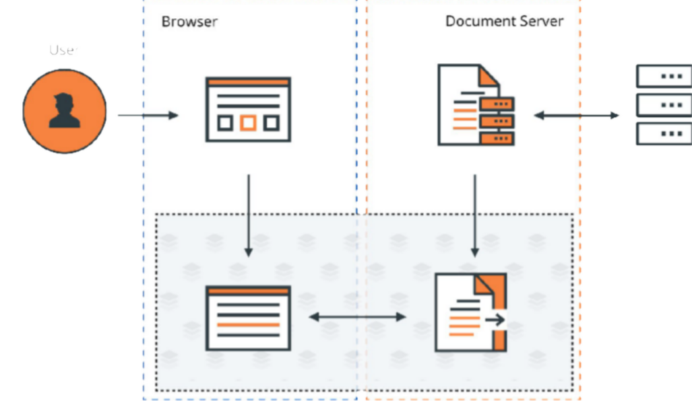
- 集成应用结构（连接器负责数据转换）：
  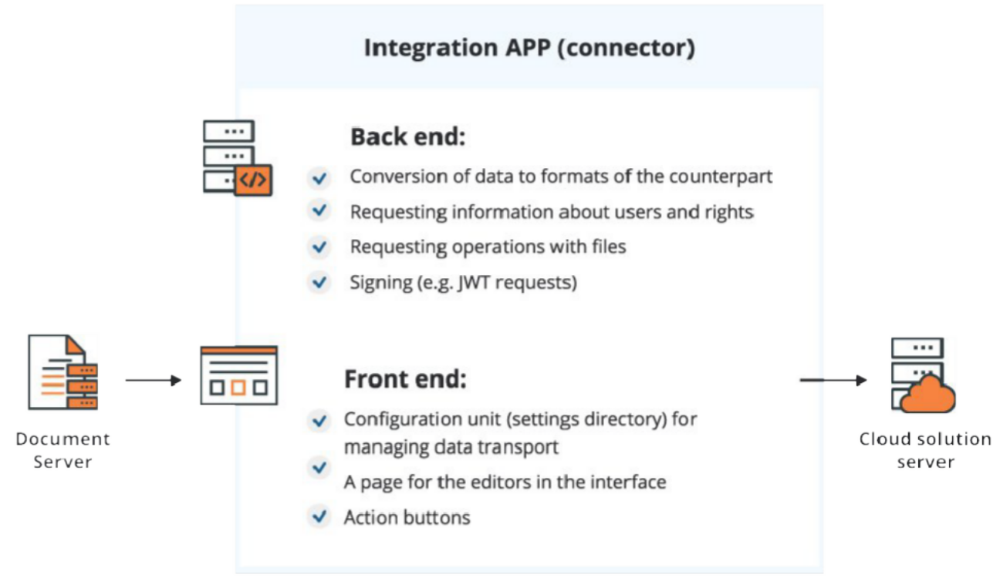

### 基于 API 集成的功能

| 功能 | 说明 |
|:--------|:---------|
| 支持格式 | 查看编辑：DOCX/XLSX/PPTX/PPSX/OFORM/DOCXF；仅查看：PDF/DJVU/TXT/CSV 等 |
| 协作模式 | 实时和段落锁定两种模式 |
| 自定义 | 界面语言/主题、隐藏按钮、品牌定制、插件扩展 |
| 基本功能 | 查看、编辑、共同编辑、移动查看、嵌入式查看 |
| 其他操作（方法） | 下载格式转换、文件收藏夹、消息提示 |
| 其他操作（事件） | 关闭/重命名/切换模式、版本历史、邮件合并、文档比较等 |
| 安全 | IP 白名单、JWT 验证 |
| 文档权限 | 查看/编辑/审查/评论/填表单/复制/下载/打印/重命名 |

## Docker 部署 Document Server

- [[官网教程]](https://helpcenter.onlyoffice.com/installation/docs-community-install-docker.aspx)

1. 拉取镜像：
```
docker pull onlyoffice/documentserver
```

2. 启动容器：
```shell
docker run -itd -p 9000:80 --restart=always \
-v D:\workNew\study\onlyoffice\DocumentServer\logs:/var/log/onlyoffice \
-v D:\workNew\study\onlyoffice\DocumentServer\data:/var/www/onlyoffice/Data \
-v D:\workNew\study\onlyoffice\DocumentServer\lib:/var/lib/onlyoffice \
-v D:\workNew\study\onlyoffice\DocumentServer\db:/var/lib/postgresql \
-e JWT_SECRET=my_jwt_secret \
onlyoffice/documentserver
```

3. 常用操作：
   - 进入容器：`docker exec -it ID /bin/bash`
   - 重启所有服务：`supervisorctl restart all`
   - 退出容器：`exit`
   - 访问地址：`http://IP:9000/`
   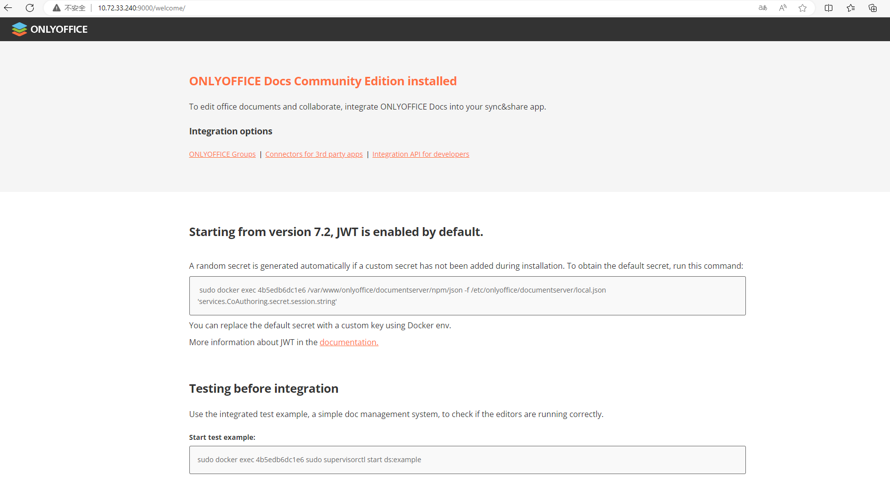

4. 页面包含：
   - 开发文档入口
   - 查看密钥命令：
   ```
   docker exec ID /var/www/onlyoffice/documentserver/npm/json -f /etc/onlyoffice/documentserver/local.json 'services.CoAuthoring.secret.session.string'
   ```
   - 启动 example 服务：
   ```
   docker exec ID sudo supervisorctl start ds:example
   ```
   - 设置 example 服务自动启动：
   ```
   docker exec ID sudo sed 's,autostart=false,autostart=true,' -i /etc/supervisor/conf.d/ds-example.conf
   ```

5. 服务列表（pkg 打包成可执行文件，摆脱 Node 环境依赖）：
   - `ds:converter`：转换器
   - `ds:docservice`：文档服务
   - `ds:example`：示例
   - `ds:metrics`

6. 服务占用端口：
   - `nginx`：80
   - `rabbitmq`：5672、25672、4369
   - `postgres`：5432
   - `docservice`：8000
   - `example`：3000
   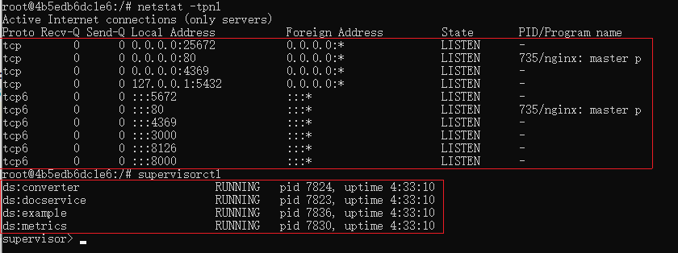

7. Example 测试页面：
   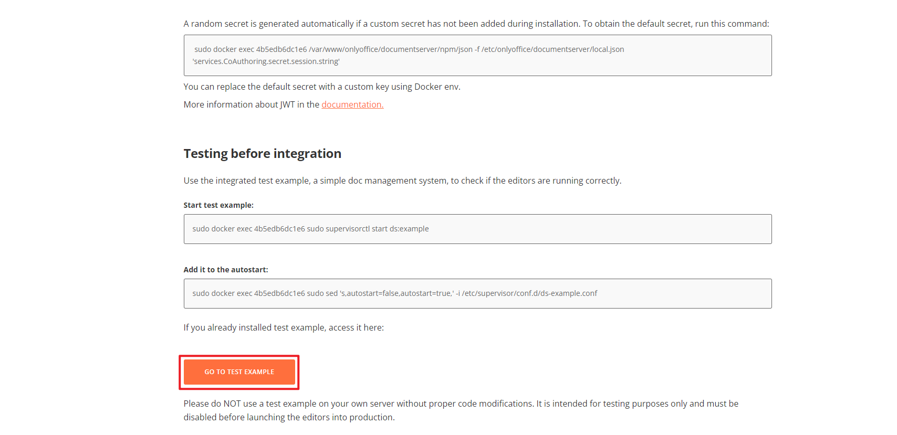
   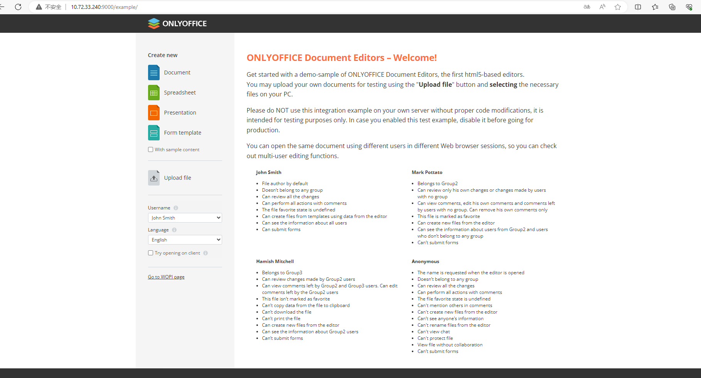

## Document Server API 教程

- [[官网教程地址]](https://api.onlyoffice.com/)

### 基本概念

- OnlyOffice API 用于将文档/电子表格/演示文稿编辑器集成到自己的网站
- API JavaScript 文件路径：
  - `https://documentserver/web-apps/apps/api/documents/api.js`
  - 其中 `documentserver` 是 Document Server 地址

### 嵌入编辑器

HTML 占位符：
```html
<div id="placeholder"></div>
<script type="text/javascript" src="https://documentserver/web-apps/apps/api/documents/api.js"></script>
```

初始化代码：
```js
var docEditor = new DocsAPI.DocEditor("placeholder", config);
```

config 示例（必需参数）：
```js
config = {
    "document": {
        "fileType": "docx",
        "key": "Khirz6zTPdfd7",
        "title": "Example Document Title.docx",
        "url": "https://example.com/url-to-example-document.docx"
    },
    "documentType": "word",
    "editorConfig": {
        "callbackUrl": "https://example.com/url-to-callback.ashx"
    }
};
```

- `example.com` 是文档管理和存储服务器地址
- 可添加更多可选参数控制访问权限、显示信息等
- 建议使用 Token（JWT）加密签名防止重要参数被篡改

### 安装 Document Server

- 支持 Windows、Linux、Docker
- 安装指南：
  - [Windows](https://helpcenter.onlyoffice.com/installation/docs-developer-install-windows.aspx)
  - [Linux](https://helpcenter.onlyoffice.com/installation/docs-developer-install-ubuntu.aspx)
  - [Docker](https://helpcenter.onlyoffice.com/installation/docs-developer-install-docker.aspx)
- 建议的后续设置：
  - 配置文件调整服务器设置
  - 切换到 HTTPS + SSL 证书
  - 添加额外字体
  - 添加自定义颜色主题

### 相关资源

- 在线体验示例（含源代码）：[Try](https://api.onlyoffice.com/editors/try)
- 各语言 Demo：[demopreview](https://api.onlyoffice.com/editors/demopreview)

## SpringBoot 集成类分析

### 依赖参考链接

- Thymeleaf：`https://blog.csdn.net/SoulNone/article/details/127572997`
- JPA：`https://blog.csdn.net/zdwzzu2006/article/details/131751921`
- H2：`https://blog.csdn.net/qq_29645505/article/details/97697093`
- JSON.simple：`https://blog.csdn.net/fireroll/article/details/48708241`
- Gson：`https://zhuanlan.zhihu.com/p/451745696`
- JWT：`https://www.cnblogs.com/hlkawa/p/13675792.html`
- JackSon：`https://blog.csdn.net/oschina_40730821/article/details/124025086`

### FileUtility / DefaultFileUtility

- 文件工具类，负责文件名后缀判断、文件类型识别、文件大小限制
- 方法：
  - `getFileExtension(String url)`：从 URL 获取文件扩展名
  - `getMaxFileSize()`：获取最大文件大小
  - `getFileExts()`：获取所有支持的文件扩展名
  - `getFileNameWithoutExtension(String url)`：获取不含扩展名的文件名
  - `getConvertExts()`：获取可转换的文件扩展名列表

### FileStorageMutator / FileStoragePathBuilder / LocalFileStorage

- 文件存储相关：Mutator（变更）、路径生成器、本地文件存储实现
- 方法：
  - `updateFile(String fileName, byte[] bytes)`：更新文件（字节写入）
  - `createMeta(String fileName, String uid, String uname)`：创建文件元信息

### DocumentManager / DefaultDocumentManager

- 文档管理器

### ServiceConverter / DefaultServiceConverter

- 文档格式转换器服务

### FileController

- 文件上传接口：`POST /upload` — 入参：文件、用户ID
- 文件转换接口：`POST /converter` — 入参：Converter、用户ID、语言
- 文件删除接口：`POST /delete` — 入参：Converter
- 文件下载接口：`POST /download` — 入参：Converter

---

# 四、代理

## 共同点

- 所处位置：都在客户端和真实服务器之间
- 所做事情：把客户端请求转发给服务器，再把服务器响应转发给客户端

## 正向代理

- 是**客户端的代理**，服务器不知道真正的客户端是谁
- 一般由**客户端架设**
- 主要用途：解决访问限制问题（翻墙、内网访问外网等）

## 反向代理

- 是**服务器的代理**，客户端不知道真正的服务器是谁
- 一般由**服务器架设**
- 主要用途：负载均衡、安全防护（隐藏真实服务器）

---

# 五、VMware

## VMware Fusion Player

- [注册 & 下载 & 许可密钥](https://customerconnect.vmware.com/evalcenter?p=fusion-player-personal)
  - 许可密钥：`51210-0H346-M8EJC-0L922-21UJ4`

## 镜像下载

（待补充）

---

# 六、VS Code 快捷键

| 功能 | 快捷键 |
| :------ | :------ |
| 格式化代码 | `Shift + Alt + F` |
| 行代码上下移动 | `Alt + ↑ / ↓` |
| 向下复制行 | `Shift + Alt + ↓` |
| 折叠所有代码块 | `Ctrl + K + 0` |
| 展开所有代码块 | `Ctrl + K + J` |
| 折叠当前代码块 | `Ctrl + Shift + [` |
| 展开当前代码块 | `Ctrl + Shift + ]` |
